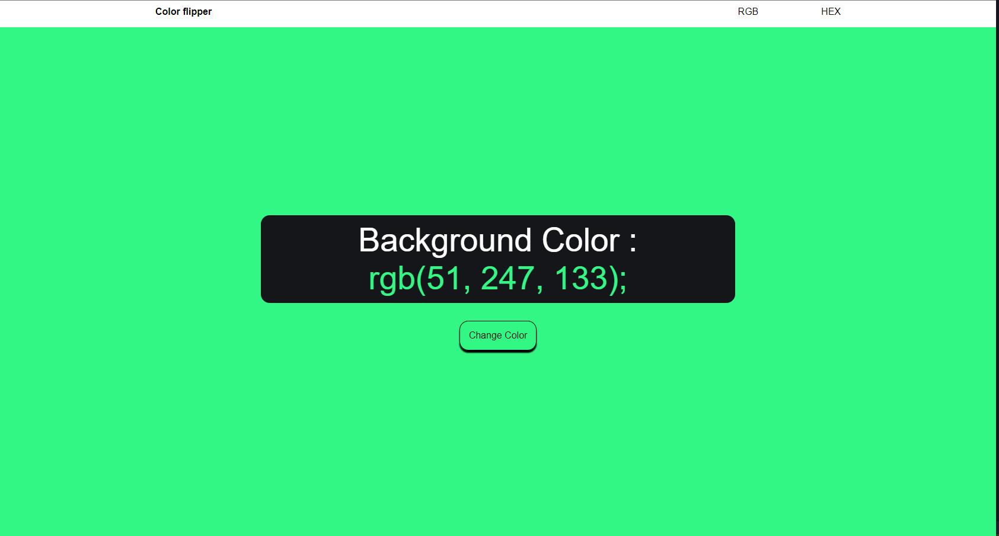

# APP COLOR FLIPPER

Con esta app web, desarrollo un programa que me permita generar de forma aleatoria un color.
En el momento que el usuario haga click en el boton "change color"

1. Que me permita cambiar el color RGB del fondo. Ejemplo: `background-color: rgb(51, 247, 133);`
2. Me mustra el color RGB en pantalla para copiarlo
3. al hacer click en el color rgb() se copiara en portapapepeles para ser pegado donde quieras

## Tecnologias utilizadas

- HTML5
- CSS3
- JavaScript